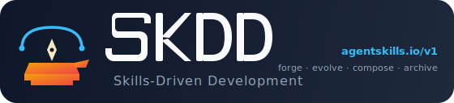
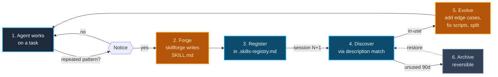

<p align="center">
  <a href="https://github.com/zakelfassi/skills-driven-development">
    
  </a>
</p>

<p align="center">
  <a href="https://www.npmjs.com/package/skdd"></a>
  <a href="https://www.npmjs.com/package/skdd"></a>
  <a href="https://github.com/zakelfassi/skills-driven-development/actions"></a>
  <a href="./LICENSE"></a>
  <a href="https://github.com/zakelfassi/skills-driven-development/stargazers"></a>
  <a href="https://agentskills.io/specification.md"></a>
</p>

# Skills-Driven Development (SkDD)

> Agents that learn by doing — and remember how they did it.

Skills-Driven Development (SkDD) is a methodology where AI agents **create, evolve, and share reusable skills** as a natural byproduct of their work. Instead of front-loading all knowledge into prompts, agents forge skills on the fly and persist them for future reuse.

## What is a skill?

A **skill** is a reusable, discoverable playbook — markdown instructions plus optional scripts and references — that an agent follows to accomplish a specific, repeatable task (e.g., "scaffold a REST endpoint", "deploy a preview branch", "triage a bug report"). Structurally it's a directory containing a `SKILL.md` file with YAML frontmatter, following the open [Agent Skills](https://agentskills.io) specification. Functionally it's process memory: agents discover skills by description, follow their steps, and evolve them when they encounter edge cases.

SkDD treats skills as **living artifacts** — discovered, forked, evolved, and composed by agents across projects and sessions. The goal is not a static skill library but a **colony** that gets smarter every time it's used.

## The Core Idea

Most agent workflows today are stateless: the agent reads a prompt, does work, and forgets. SkDD adds a feedback loop:

```
Work → Notice a reusable pattern → Forge a skill → Persist it → Discover it next time
```

This turns agent experience into **compound knowledge**. The more an agent works, the better it gets — not because the model improves, but because the skill colony grows.

## The SkDD Lifecycle



Every loop through the diagram *improves* the colony. Archiving is reversible; nothing is ever deleted.

## What This Repo Contains

| Path | What it is |
|------|-----------|
| [`docs/`](docs/) | The methodology: skill colony concept, forging mechanics, specification alignment |
| [`skillforge/`](skillforge/) | The meta-skill: agents use this to create new skills |
| [`examples/`](examples/) | Reference structure of a SkDD-enabled project (skills, registry, AGENTS.md — not a runnable webapp) |
| [`colony/`](colony/) | The skill colony pattern: discovery, evolution, sharing |

## Quick Start

SkDD works in any harness that understands the Agent Skills spec (Claude Code, Codex, Cursor, GitHub Copilot, Gemini CLI, OpenCode, Goose, Amp, and more). Skills live in a single canonical `skills/` directory at the project root, and each harness sees them through a symlink (Unix) or file copy (Windows) mirror — one source of truth, N places to discover from. The four steps below assume **Claude Code**; see [docs/configuration.md](docs/configuration.md) for Codex, Cursor, Copilot, and the others.

### Step 1 — Scaffold the colony

Run this from the root of **your own project** (not this repo):

```bash
# With the CLI (recommended)
pnpm dlx skdd init --harness=claude
```

That one command creates `skills/skillforge/SKILL.md` (a stub of the meta-skill), `.skills-registry.md` at the project root, a `## Skills` block appended to `CLAUDE.md`, and a `.claude/skills` symlink → `../skills` so Claude Code discovers the colony at its conventional path. A `.skdd-sync.json` state file tracks the mirror so `skdd link` can reconcile drift later.

Prefer to stay CLI-free? The manual equivalent:

```bash
mkdir -p skills/skillforge
curl -fsSL https://raw.githubusercontent.com/zakelfassi/skills-driven-development/main/skillforge/SKILL.md \
  -o skills/skillforge/SKILL.md
touch .skills-registry.md
ln -s ../skills .claude/skills      # Unix; Windows users copy skills/ → .claude/skills
```

### Step 2 — Tell the agent to use the colony

`skdd init` already wrote the block below into `CLAUDE.md`. If you're going manual, add it yourself:

```markdown
## Skills

Skills live at `skills/<name>/SKILL.md` (canonical, single source of truth). The registry is at `.skills-registry.md` in the project root. `.claude/skills` is a mirror maintained by `skdd link` so Claude Code can find skills at its conventional path.

At session start, read `.skills-registry.md` to discover available skills. Before deriving a solution, check whether an existing skill covers the task and follow it. When you notice a pattern repeat 2–3 times, or when I ask you to "forge a skill for X", invoke the `skillforge` skill and follow its steps. Always write new skills to `skills/`, never to the mirror.
```

This is the "discovery contract." Without it, the agent won't know to look.

### Step 3 — Trigger the skillforge

Forging is a natural-language prompt, not a CLI command. Any of these work:

- *"Forge a skill for scaffolding a new API endpoint. Follow the skillforge steps."*
- *"We've done this deploy dance three times today — let's make it a skill."*
- *"Save this workflow as a skill so next session's agent can reuse it."*

The agent reads `skills/skillforge/SKILL.md`, walks through its checklist, writes a new skill to `skills/<name>/SKILL.md`, and appends a row to `.skills-registry.md`. If you installed the CLI, `skdd forge <name>` does the same thing non-interactively and refreshes the harness mirror in one go.

### Step 4 — Verify it persisted

Open a **fresh** Claude Code session in the same project and ask:

- *"What skills are available in this project?"*

The agent should list the skill you just forged. That confirms the discovery loop closed — the skill is now process memory that survives sessions.

> **Multiple harnesses on the same project?** Run `skdd link --harness=claude,codex,cursor` to materialize mirrors for all of them at once. One `skills/` directory, many mirror paths — no duplication, no drift.
>
> **When does discovery happen?** Not "automatically." It happens because step 2 added instructions that tell the agent to read the registry. SkDD is a set of conventions, a meta-skill, and a CLI; the harness (Claude Code, Codex, etc.) is what actually loads the skills when prompted.

## The Skill Colony

When skills accumulate across projects and agents, they form a **skill colony** — a shared, evolving library of capabilities that agents can discover, fork, and adapt.

See [colony/README.md](colony/README.md) for the full concept.

```
Project A forges:   deploy-preview
Project B forks:    deploy-preview → deploy-preview-vercel
Project C discovers: deploy-preview-vercel (via registry)
Agent X evolves:    deploy-preview-vercel (adds rollback)
```

Skills aren't static documentation. They're **living process memory**.

## How SkDD Relates to the Agent Skills Spec

SkDD is fully compatible with the [Agent Skills specification](https://agentskills.io/specification.md):

| Agent Skills Spec | SkDD Extension |
|-------------------|----------------|
| `SKILL.md` with YAML frontmatter | ✅ Same format |
| `scripts/`, `references/`, `assets/` | ✅ Same structure |
| Manual skill creation | ➕ Agents forge skills autonomously |
| Static skill libraries | ➕ Skills evolve through use |
| Per-project skills | ➕ Colony-level discovery + sharing |

SkDD doesn't replace the spec — it adds a **lifecycle** on top of it.

## Principles

### 1. Forge, don't front-load
Don't try to anticipate every skill upfront. Let agents create skills when they notice patterns during real work.

### 2. Small skills, composed loosely
Each skill should do one thing well. Complex workflows emerge from composing small skills, not from monolithic instruction sets.

### 3. Skills are living documents
A skill that was forged 3 months ago and never updated is dead weight. Agents should evolve skills when they encounter edge cases or better approaches.

### 4. The colony is the product
Individual skills are useful. A colony of skills that agents can discover and compose is transformative. Invest in the registry and discovery mechanisms.

### 5. Human-readable, machine-executable
Skills are markdown files that humans can read, review, and edit. But they're structured so agents can parse, discover, and execute them without human intervention.

## Inspiration & Prior Art

- [Agent Skills Specification](https://agentskills.io) — The open format this builds on
- [Forgeloop](https://github.com/zakelfassi/forgeloop-kit) — Agentic build loop framework where SkDD was first implemented (embedded under the hood before it was extracted as a standalone methodology)
- [how-to-ralph-wiggum](https://github.com/ghuntley/how-to-ralph-wiggum) — The Ralph methodology for agent-driven development
- [marge-simpson](https://github.com/Soupernerd/marge-simpson) — Knowledge persistence patterns across sessions

## License

MIT — see [LICENSE](LICENSE).
