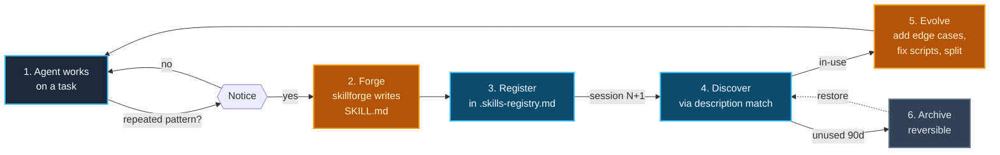

<p align="center">
  <a href="https://zakelfassi.github.io/skills-driven-development">
    <picture>
      <source media="(prefers-color-scheme: dark)" srcset="./assets/wordmark.svg">
      <source media="(prefers-color-scheme: light)" srcset="./assets/wordmark-light.svg">
      
    </picture>
  </a>
</p>

<p align="center">
  <em>Agents that learn by doing — and remember how they did it.</em>
</p>

<p align="center">
  <a href="https://www.npmjs.com/package/@zakelfassi/skdd"></a>
  <a href="https://www.npmjs.com/package/@zakelfassi/skdd"></a>
  <a href="https://github.com/zakelfassi/skills-driven-development/actions/workflows/ci.yml"></a>
  <a href="./LICENSE"></a>
  <a href="https://github.com/zakelfassi/skills-driven-development/stargazers"></a>
  <a href="https://agentskills.io/specification.md"></a>
  <a href="https://zakelfassi.github.io/skills-driven-development"></a>
</p>

---

## What is SkDD?

**Skills-Driven Development (SkDD)** is a methodology where AI agents **create, evolve, and share reusable skills** as a natural byproduct of their work. Instead of front-loading all knowledge into prompts, agents forge skills on the fly and persist them for future reuse.

A **skill** is a reusable, discoverable playbook — a `SKILL.md` file with YAML frontmatter following the open [Agent Skills](https://agentskills.io) specification. Structurally it's a directory with markdown instructions, optional scripts, and references. Functionally it's **process memory**: agents discover skills by description, follow their steps, and evolve them when they encounter edge cases.

SkDD treats skills as *living artifacts* — discovered, forked, evolved, and composed across projects and sessions. The goal is not a static library but a **colony** that gets smarter every time it's used.

---

## Quickstart

Run these three commands in **your own project** (not this repo):

```bash
# 1. Scaffold the colony (adds skills/, registry, CLAUDE.md block, harness mirror)
pnpm dlx @zakelfassi/skdd init --harness=claude

# 2. Forge your first skill (natural language — agent walks the skillforge steps)
# Tell your agent: "Forge a skill for <your workflow>. Follow the skillforge steps."

# 3. Verify it persisted — open a fresh session and ask:
# "What skills are available in this project?"
```

See [watch the loop run →](https://zakelfassi.github.io/skills-driven-development) for a recorded terminal walkthrough: `init → forge → doctor`.

---

## The SkDD Lifecycle



Every loop through the diagram *improves* the colony. Archiving is reversible; nothing is ever deleted.

---

## SkDD Commons — skills that evolve in public

Community skills live in **[SkDD Commons](https://github.com/zakelfassi/skdd-commons)**, released as curated, dated **drops**. Unlike static skill lists, every Commons skill carries lifecycle metadata (`forged-by`, `forged-from`, `forged-reason`) and an evolution loop: hit an edge case in the wild, fix your local copy, and `skdd push` ships the diff upstream as a PR. A skill that has evolved across many codebases carries a trust signal no static collection can fake.

```bash
# Install the current drop — six skills forged by claude-fable-5 on 2026-07-01
pnpm dlx @zakelfassi/skdd add zakelfassi/skdd-commons 2026-07-frontier

# See what's on offer / push your evolution back
skdd drops
skdd push what-would-you-cut
```

Current drop: [`2026-07-frontier` — July 2026 Frontier, the Fable Festival drop](https://github.com/zakelfassi/skdd-commons/tree/main/packs/2026-07-frontier). See [`packs/README.md`](packs/README.md) for the pack concept and [`docs/commons.md`](docs/commons.md) for the full add/push flow.

---

## Hub & Global Colony

*This is the 1.0 headline.*

SkDD 1.0 ships a **global colony** at `~/.skdd/` — one canonical place to manage skills and MCP servers across every harness on your machine.

```bash
# Initialize the global colony (links to all installed harness dirs)
skdd init --global

# See everything at a glance: skills, mirrors, MCP servers, doctor status
skdd hub

# Sync MCP server configs from ~/.skdd/mcp.json to all supported MCP hosts (7)
skdd mcp sync

# List skills across project + global colony
skdd list --global
```

`~/.skdd/` layout:

```
~/.skdd/
├── skills/               # global skill colony (shared across all projects)
├── .skills-registry.md   # global registry
├── .skdd-sync.json       # mirror state (v2)
└── mcp.json              # canonical MCP server registry
```

**`skdd hub`** opens an Ink TUI with four panes: skills (project + global), mirror status + link/unlink toggles, MCP server × host matrix, and a doctor report — all in one screen.

**`skdd mcp sync`** writes your `~/.skdd/mcp.json` to all installed harness configs using merge-not-overwrite adapters. Supports `${VAR}` environment placeholders (secrets never round-trip), per-server host allowlists, and `--dry-run` mode. Adapters cover all 7 MCP hosts: `claude-code`, `claude-desktop`, `codex`, `droid`, `cursor`, `opencode`, `gemini`. (The 9 harnesses in the support matrix include 2 that do not have an MCP config format: GitHub Copilot and Goose.)

---

## Examples Gallery

Three reference colonies — every example passes `skdd validate` and `skdd doctor`:

| Colony | Persona | Skills | What it demonstrates |
|---|---|---|---|
| [`examples/webapp-starter`](examples/webapp-starter/) | React + TypeScript + Express web app | 4 | Component scaffolding, API endpoints, deploy previews, bug triage |
| [`examples/cli-tool`](examples/cli-tool/) | Cross-platform CLI (`shipctl`) | 5 | Release pipelines, build matrices, flag management, man pages, breaking-change audits |
| [`examples/data-pipeline`](examples/data-pipeline/) | Python ETL + ML project | 5 | Dataset onboarding, pipeline scaffolding, experiment logging, data quality gates, backfills |

Each colony ships with `AGENTS.md`, `CLAUDE.md`, `.skills-registry.md` (including archived + forked rows), `.colony.json`, and at least one executable stub script. Browse the [Examples gallery →](https://zakelfassi.github.io/skills-driven-development/examples/) for full walkthroughs.

---

## Harness Support Matrix

SkDD works in any harness that understands the Agent Skills spec. Skills live in a single canonical `skills/` directory; each harness sees them through its own mirror path (symlink on Unix, copy on Windows).

| Harness | Project dir | Global dir | Mirror | Guide |
|---|---|---|---|---|
| **Claude Code** | `.claude/skills` | `~/.claude/skills` | symlink / copy | [docs](docs/integrations/claude-code.md) |
| **OpenAI Codex** | `.codex/skills` | `~/.codex/skills` | symlink / copy | [docs](docs/integrations/codex.md) |
| **Cursor** | `.cursor/skills` | `~/.cursor/skills` | symlink / copy | [docs](docs/integrations/cursor.md) |
| **GitHub Copilot** | `.github/skills` | `~/.copilot/skills` | symlink / copy | [docs](docs/integrations/github-copilot.md) |
| **Gemini CLI** | `.gemini/skills` | `~/.gemini/skills` | symlink / copy | [docs](docs/integrations/gemini-cli.md) |
| **OpenCode** | `.opencode/skills` | `~/.config/opencode/skills` | symlink / copy | [docs](docs/integrations/opencode.md) |
| **Goose** | `.goose/skills` | `~/.agents/skills` | symlink / copy | [docs](docs/integrations/goose.md) |
| **Amp** | `.amp/skills` | `~/.config/agents/skills` | symlink / copy | [docs](docs/integrations/amp.md) |
| **Factory Droid** | `.factory/skills` | `~/.factory/skills` | symlink / copy | [docs](docs/integrations/droid.md) |

Use `skdd init --harness=<name>` for a single harness, or `skdd link --harness=claude,codex,cursor` to materialize mirrors for multiple harnesses at once. One `skills/` directory — no duplication, no drift.

---

## What's in This Repo

| Path | What it is |
|---|---|
| [`cli/`](cli/) | `@zakelfassi/skdd` — TypeScript ESM CLI (init, forge, list, show, link, doctor, import, validate, mcp, hub) |
| [`skillforge/`](skillforge/) | The meta-skill: agents use this to create new skills |
| [`examples/`](examples/) | Three reference colonies (webapp-starter, cli-tool, data-pipeline) — every example passes `skdd validate` and `skdd doctor` |
| [`docs/`](docs/) | Methodology: skill colony concept, forging mechanics, specification alignment, harness integration guides |
| [`colony/`](colony/) | The skill colony pattern: discovery, evolution, sharing |
| [`plugins/skdd-claude/`](plugins/skdd-claude/) | Claude Code plugin (bundled skillforge, install instructions) |
| [`extensions/vscode/`](extensions/vscode/) | VS Code extension scaffold (syntax highlighting, snippets) |
| [`site/`](site/) | Astro/Starlight documentation site |
| [`assets/`](assets/) | Brand assets: dark/light logo, wordmark, mark, OG image, BRAND.md token guide |

---

## Spec Alignment

SkDD is fully compatible with the [Agent Skills specification](https://agentskills.io/specification.md):

| Agent Skills Spec | SkDD Extension |
|---|---|
| `SKILL.md` with YAML frontmatter | ✅ Same format |
| `scripts/`, `references/`, `assets/` | ✅ Same structure |
| Manual skill creation | ➕ Agents forge skills autonomously |
| Static skill libraries | ➕ Skills evolve through use |
| Per-project skills | ➕ Colony-level discovery + sharing + global hub |

SkDD doesn't replace the spec — it adds a **lifecycle** on top of it.

---

## Principles

1. **Forge, don't front-load.** Let agents create skills when they notice patterns during real work.
2. **Small skills, composed loosely.** Each skill does one thing well; complexity emerges from composition, not monoliths.
3. **Skills are living documents.** A skill that was forged 3 months ago and never updated is dead weight — evolve it.
4. **The colony is the product.** Individual skills are useful; a discoverable, composable colony is transformative.
5. **Human-readable, machine-executable.** Markdown humans can read and review; structured so agents can parse and follow without intervention.

---

## Community

- **Contributing:** See [CONTRIBUTING.md](CONTRIBUTING.md) — conventional commits, PR template, issue labels.
- **Code of Conduct:** [CODE_OF_CONDUCT.md](CODE_OF_CONDUCT.md)
- **Security:** [SECURITY.md](SECURITY.md)
- **Docs site:** [zakelfassi.github.io/skills-driven-development](https://zakelfassi.github.io/skills-driven-development)
- **Changelog:** [CHANGELOG.md](CHANGELOG.md)

---

## Inspiration & Prior Art

- [Agent Skills Specification](https://agentskills.io) — The open format this builds on
- [Forgeloop](https://github.com/zakelfassi/forgeloop-kit) — Agentic build loop framework where SkDD was first implemented
- [how-to-ralph-wiggum](https://github.com/ghuntley/how-to-ralph-wiggum) — The Ralph methodology for agent-driven development
- [marge-simpson](https://github.com/Soupernerd/marge-simpson) — Knowledge persistence patterns across sessions

## License

MIT — see [LICENSE](LICENSE).
