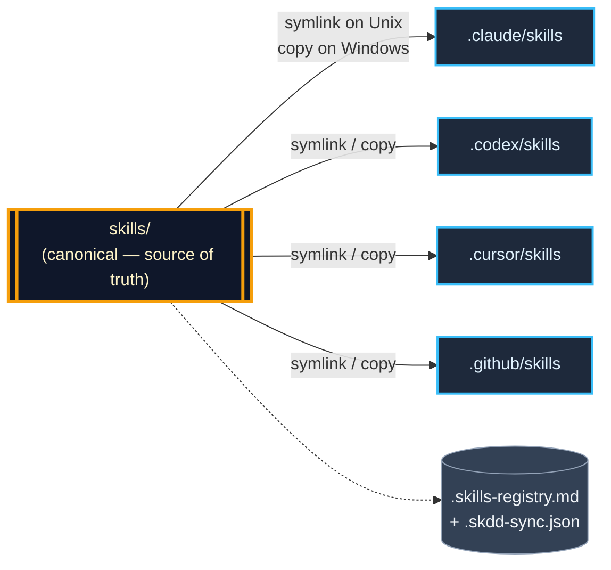

> How to wire SkDD into each supported agent harness.

SkDD is a set of conventions plus a meta-skill (`skillforge`) plus a CLI (`skdd`). The actual loading, matching, and invocation of skills is done by your agent harness — Claude Code, Codex, Cursor, GitHub Copilot, Gemini CLI, OpenCode, Goose, or Amp. This doc walks through the wiring so you can go from "interested" to "first skill forged" in a few minutes.

## The canonical pattern

Every harness expects skills in its own magic directory (`.claude/skills/`, `.codex/skills/`, `.cursor/skills/`, …). SkDD's answer is a **canonical** `skills/` directory at the project root plus per-harness **mirrors** (symlinks on Unix, file copies on Windows) managed by `skdd link`. Edit in one place, every harness sees the same bytes, no drift.



Directory layout for a live project:

```
my-project/
├── skills/                    # canonical — the source of truth
│   ├── skillforge/SKILL.md
│   └── <your forged skills>/
├── .skills-registry.md        # colony registry (human-readable)
├── .skdd-sync.json            # mirror state tracked by skdd link
├── .claude/skills → ../skills  # symlink (Unix) or copy (Windows)
├── .codex/skills  → ../skills
└── .cursor/skills → ../skills
```

If you only use one harness, the mirror is invisible — you'll never notice it. If you use three, the CLI keeps them all in sync with `skdd link`.

## The universal install

```bash
# With the CLI (recommended; pnpm required per repo policy)
pnpm dlx @zakelfassi/skdd init --harness=claude      # or codex / cursor / copilot / gemini / opencode / goose / amp / auto
```

That creates `skills/skillforge/SKILL.md`, `.skills-registry.md`, the harness-specific instruction file with a `## Skills` block appended, a `.<harness>/skills` mirror pointing at `../skills`, and a `.skdd-sync.json` state file. Re-run `skdd link` any time to reconcile drift or add mirrors for additional harnesses.

Manual equivalent (if you don't want the CLI yet):

```bash
mkdir -p skills/skillforge
curl -fsSL https://raw.githubusercontent.com/zakelfassi/skills-driven-development/main/skillforge/SKILL.md \
  -o skills/skillforge/SKILL.md
touch .skills-registry.md
mkdir -p .claude && ln -s ../skills .claude/skills    # Unix only; Windows: copy the dir
```

Then add the skills block (see each harness section below) to the instruction file your harness reads.

## Per-harness specifics

Every section below tells you **which instruction file to edit**, **what to paste into it**, and **how to verify**. The install step is the same for all of them: run `skdd init --harness=<name>` (or the manual equivalent). If you already ran init for one harness and want to add another, run `skdd link --harness=<new-name>` — your canonical `skills/` stays the same, only the mirror list grows.

---

### Claude Code

- **Instruction file**: `CLAUDE.md` at the repo root
- **Mirror**: `.claude/skills/` → `../skills`
- **Scopes**: personal (`~/.claude/skills/`), project (`.claude/skills/` — SkDD uses this), plugin, enterprise

Install: `pnpm dlx @zakelfassi/skdd init --harness=claude`

Skills block (auto-written by `skdd init`):

```markdown
## Skills

Skills live at `skills/<name>/SKILL.md` (canonical, single source of truth). The registry is at `.skills-registry.md` in the project root. `.claude/skills` is a mirror maintained by `skdd link` so Claude Code can find skills at its conventional path.

At session start, read `.skills-registry.md` to discover available skills. Before deriving a solution, check whether an existing skill covers the task and follow it. When you notice a pattern repeat 2-3 times, or when I ask you to "forge a skill for X", invoke the `skillforge` skill and follow its steps. Always write new skills to `skills/`, never to the mirror.
```

Verify in a fresh session:

1. *"What skills are available in this project?"* — lists `skillforge` from `.skills-registry.md`
2. *"Forge a skill for running database migrations."* — walks through `skillforge/SKILL.md` and writes a new skill under `skills/`
3. *(fresh session)* *"List skills."* — the new skill persists

Monorepo note: Claude Code auto-discovers nested `.claude/skills/`. You can keep per-package canonical dirs (`packages/frontend/skills/`) with per-package mirrors (`packages/frontend/.claude/skills`) and each scope will resolve locally.

See [`docs/integrations/claude-code.md`](integrations/claude-code.md) for the full deep-dive, including the optional one-click plugin install.

---

### OpenAI Codex

- **Instruction file**: `AGENTS.md` at the repo root
- **Mirror**: `.codex/skills/` → `../skills`
- **Scopes**: user (`~/.codex/skills/`), project (`.codex/skills/`)

Install: `pnpm dlx @zakelfassi/skdd init --harness=codex`

Paste the same skills block as Claude Code, but swap `.claude/skills` → `.codex/skills` in the text.

Verify with the three-question check (`What skills do we have?` → `Forge …` → fresh session → `List skills`). See [developers.openai.com/codex/skills](https://developers.openai.com/codex/skills) for Codex's own docs.

---

### Cursor

- **Instruction file**: `.cursor/rules/skills.mdc` (Cursor's agent-mode rules format)
- **Mirror**: `.cursor/skills/` → `../skills`

Install: `pnpm dlx @zakelfassi/skdd init --harness=cursor`

Skills block (the rules file needs `alwaysApply: true` frontmatter so every agent conversation picks it up):

```markdown
---
description: Skills-Driven Development colony wiring
alwaysApply: true
---

Skills live at `skills/<name>/SKILL.md` (canonical, single source of truth). `.cursor/skills` is a mirror maintained by `skdd link`. The registry is at `.skills-registry.md` in the project root. …
```

Verify in Cursor's agent chat. Full details at [`docs/integrations/cursor.md`](integrations/cursor.md) and [cursor.com/docs/context/skills](https://cursor.com/docs/context/skills).

---

### GitHub Copilot

- **Instruction file**: `.github/copilot-instructions.md`
- **Mirror**: `.github/skills/` → `../skills`
- **Applies to**: Copilot agent surfaces (Chat, Workspace, Coding Agent). Inline ghost-text completions don't see skills.

Install: `pnpm dlx @zakelfassi/skdd init --harness=copilot`

Verify in Copilot Chat with `@workspace what skills are registered?`. Full details at [`docs/integrations/github-copilot.md`](integrations/github-copilot.md).

---

### Gemini CLI

- **Instruction file**: `AGENTS.md`
- **Mirror**: `.gemini/skills/` → `../skills`

Install: `pnpm dlx @zakelfassi/skdd init --harness=gemini`. See [geminicli.com/docs/cli/skills/](https://geminicli.com/docs/cli/skills/) and [`docs/integrations/gemini-cli.md`](integrations/gemini-cli.md).

---

### OpenCode

- **Instruction file**: `AGENTS.md`
- **Mirror**: `.opencode/skills/` → `../skills`

Install: `pnpm dlx @zakelfassi/skdd init --harness=opencode`. See [opencode.ai/docs/skills/](https://opencode.ai/docs/skills/) and [`docs/integrations/opencode.md`](integrations/opencode.md).

---

### Goose

- **Instruction file**: `AGENTS.md` (or `.goose/config.yaml` for Goose-specific settings)
- **Mirror**: `.goose/skills/` → `../skills`

Install: `pnpm dlx @zakelfassi/skdd init --harness=goose`. See [block.github.io/goose/docs/guides/context-engineering/using-skills/](https://block.github.io/goose/docs/guides/context-engineering/using-skills/) and [`docs/integrations/goose.md`](integrations/goose.md).

---

### Amp

- **Instruction file**: `AGENTS.md`
- **Mirror**: `.amp/skills/` → `../skills`

Install: `pnpm dlx @zakelfassi/skdd init --harness=amp`. See [ampcode.com/manual#agent-skills](https://ampcode.com/manual#agent-skills) and [`docs/integrations/amp.md`](integrations/amp.md).

---

### Factory Droid

- **Instruction file**: `AGENTS.md`
- **Mirror**: `.factory/skills/` → `../skills`
- **Global skills**: `~/.factory/skills/` (personal, follows you across all projects)
- **MCP config**: `~/.factory/mcp.json` (managed by `skdd mcp sync`)

Install: `pnpm dlx @zakelfassi/skdd init --harness=droid`

Skills block (auto-written by `skdd init`):

```markdown
## Skills

Skills live at `skills/<name>/SKILL.md` (canonical, single source of truth). The registry is at `.skills-registry.md` in the project root. `.factory/skills` is a mirror maintained by `skdd link` so Factory Droid can find skills at its conventional path.

At session start, read `.skills-registry.md` to discover available skills. Before deriving a solution, check whether an existing skill covers the task and follow it. When you notice a pattern repeat 2-3 times, or when I ask you to "forge a skill for X", invoke the `skillforge` skill and follow its steps. Always write new skills to `skills/`, never to the mirror.
```

Full details at [`docs/integrations/droid.md`](integrations/droid.md).

---

## Using one colony across multiple harnesses

This is the common case once you've tried SkDD on one harness and want the same colony everywhere else. `skills/` is the single source of truth and `skdd link` materializes every requested mirror:

```bash
skdd link --harness=claude,codex,cursor,copilot,droid
```

Re-run the command anytime a new harness gets installed or a mirror drifts. `.skdd-sync.json` tracks what's been materialized, so it's idempotent — no-ops when everything's in sync, drift-repair when it isn't.

## Global colony (`--global` / `-g`)

A **global colony** at `~/.skdd/` holds skills that travel with you rather than with any one project. The `--global` flag is available on `init`, `link`, `doctor`, `list`, `forge`, and `import`.

```bash
# One-time setup: create ~/.skdd/ and link to all reachable harness global dirs
skdd init --global

# Forge a personal skill into the global colony
skdd forge -g --name=commit-message-style

# Check global colony health
skdd doctor -g

# List globally available skills
skdd list -g
```

Global mirrors use each harness's user-level skills directory:

| Harness | Global skills dir |
|---------|-------------------|
| Claude Code | `~/.claude/skills/` |
| OpenAI Codex | `~/.codex/skills/` |
| Cursor | `~/.cursor/skills/` |
| GitHub Copilot | `~/.copilot/skills/` |
| Gemini CLI | `~/.gemini/skills/` |
| OpenCode | `~/.config/opencode/skills/` |
| Goose | `~/.agents/skills/` |
| Amp | `~/.config/agents/skills/` |
| Factory Droid | `~/.factory/skills/` |

See [`docs/global-colony.md`](global-colony.md) for the full guide, including the safe migration path for pre-existing global skills directories.

## MCP server management

`skdd mcp` manages a canonical catalogue of MCP (Model Context Protocol) servers at `~/.skdd/mcp.json` and syncs it to all seven AI hosts that support MCP:

```bash
# Add a server
skdd mcp add my-tool --command npx --args "-y,@acme/my-tool-mcp" --env "API_KEY=\${MY_KEY}"

# Preview sync without writing
skdd mcp sync --dry-run

# Sync to all available hosts
skdd mcp sync
```

Supported hosts: `claude-code`, `claude-desktop`, `codex`, `droid`, `cursor`, `opencode`, `gemini`.

See [`docs/mcp-sync.md`](mcp-sync.md) for the full guide including the canonical schema, `${VAR}` placeholder expansion, backup/atomic-write guarantees, and the secrets-never-round-trip guarantee.

## Troubleshooting

**Agent doesn't discover the skillforge.** The skills block in your instruction file is probably missing or mis-scoped. Open a fresh session and explicitly prompt: *"Read `.skills-registry.md` and list what's there."* If that works but the agent doesn't auto-scan, the instruction file isn't being loaded — check the harness docs for the exact filename and scope.

**Agent forges skills but they land in the wrong place.** The agent likely wrote to `.claude/skills/<name>/` directly instead of `skills/<name>/`. Re-prompt: *"Write skills to `skills/<name>/`, not the mirror. The mirror is auto-managed by `skdd link`."* Then run `skdd link` to reconcile.

**Symlinks don't work on my machine.** You're probably on Windows without developer mode / elevated shell. Run `skdd init --harness=<name>` — the CLI detects Windows and falls back to file copies tracked in `.skdd-sync.json`. Re-run `skdd link` after editing `skills/` to refresh the copies.

**Multiple agents forge the same skill differently.** Let them coexist under different names and use `skdd list` to see usage counts. The more-used one wins; the other can be archived.

**Scripts in a forged skill don't run.** Skills can include `scripts/` but the harness has to grant the agent tool permissions to execute them. Check your harness's tool-use policy and add an `allowed-tools` line to the skill's frontmatter if needed.
