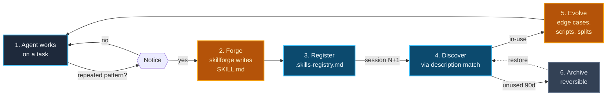

# Why SkDD?

> A skill whose job is to create other skills. That's the whole thing.

Skills-Driven Development answers a question that every serious agent-tooling user eventually asks: **"I keep teaching my agent the same thing. How do I make it stop forgetting?"**

The answer is obvious in hindsight. Write the thing down once, in a structured file the agent can discover next time, and have the agent do the writing itself when it notices a pattern. SkDD is the set of conventions, meta-skill, and CLI that makes that loop actually work across every major agent harness.

## The one-minute pitch

1. **Your agent finishes a task.** Normally it forgets everything and starts from scratch next session.
2. **SkDD's `skillforge` meta-skill** watches for repetition. After 2–3 times doing the same kind of work ("scaffold a REST endpoint", "triage a bug", "deploy a preview"), it tells the agent: *forge this into a skill*.
3. **The agent writes a `SKILL.md`** — a spec-compliant, kebab-case, [Agent Skills](https://agentskills.io) file in canonical `skills/<name>/`. The registry gets a new row. The harness mirror (`.claude/skills`, `.codex/skills`, …) refreshes automatically.
4. **Next session, any agent in this project** (Claude Code, Codex, Cursor, Copilot, Gemini, OpenCode, Goose, Amp, whatever) reads the registry, sees the skill, and follows it. Zero re-prompting.
5. **Over time, the colony compounds.** Skills get evolved, forked across projects, or archived if they decay. The more work the agents do, the smarter the project gets.

That's the whole pitch. Everything in this repo exists to make that loop fast, safe, and portable across harnesses.

## The meta-skill is the unlock

`skillforge` is the genuinely novel artifact in this project. It's **a skill whose single job is to create other skills**. Most "skills" libraries are static: some human writes them, commits them, publishes them to a marketplace, and that's that. SkDD inverts it — the agent creates the skills during real work, under the guidance of a meta-skill that enforces spec compliance, naming, description quality, and lifecycle metadata.

Why that matters:

- **Zero upfront curation.** You don't have to anticipate what skills your project needs. They emerge from the work the agent is already doing.
- **Signal over guesswork.** A skill that gets forged from 3 real repetitions is more useful than a skill someone wrote speculatively at midnight.
- **The colony stays relevant.** Unused skills decay (tracked via `usage-count` and `last-used` metadata). High-use skills survive and get evolved. Natural selection, not editorial policy.

## Who SkDD is for

| You're... | SkDD helps you by... |
|-----------|----------------------|
| A solo dev juggling Claude Code and one other harness | One canonical `skills/` dir. Every harness sees the same bytes via `skdd link` mirrors. No drift. |
| A team with a monorepo and multiple agent tools | `skdd init` + the instruction-block rule ("always write to `skills/`, never the mirror") keeps everyone editing the same source. |
| Building agentic CI or batch tooling | `skdd validate` in CI, `skdd doctor` for health checks, `--json` output on every command for machine consumption. |
| A plugin author shipping a Claude Code / Cursor / Codex extension | `plugins/skdd-claude/` shows the pattern: ship a colony seed, users run `skdd init`, the rest is conventions. |
| Running a "skills marketplace" indexer | `.colony.json` is a JSON Schema–validated manifest. One schema, every marketplace. See [`docs/spec/colony-v1.json`](spec/colony-v1.json). |

## Who SkDD is not for

- **Teams that want every skill reviewed by a human before it's used.** SkDD's bias is *forge now, review via evolution later.* If your org needs upfront review gates, use a static skill library and point agents at it — SkDD is overkill.
- **Projects where agents do mostly one-off work.** The ROI on forging a skill kicks in after ~3 repetitions. If your agent never repeats anything, skip the lifecycle machinery and use the [Agent Skills spec](https://agentskills.io/specification.md) directly.
- **Single-harness shops that never want mirrors.** Use `skdd init --no-canonical` to get a flat `.claude/skills/` (or equivalent) layout and the canonical/mirror machinery stays out of your way.

## The lifecycle in one picture



Each step has a concrete file and a concrete command:

| Step | File | Who writes it | Command |
|---|---|---|---|
| 1 · Work | project code | agent + human | normal dev loop |
| 2 · Forge | `skills/<name>/SKILL.md` | agent, guided by `skillforge` | `skdd forge` (or natural-language prompt) |
| 3 · Register | `.skills-registry.md` + `.skills-registry.json` | CLI | auto on forge |
| 4 · Discover | instruction file (`CLAUDE.md`, etc.) | human (once, via `skdd init`) | session start |
| 5 · Evolve | existing `SKILL.md` | agent | edit in place |
| 6 · Archive | registry `status: archived` | CLI or human | `skdd list` + edit |

## What SkDD is not

- **Not a new spec.** SkDD is 100% compatible with [agentskills.io/v1](https://agentskills.io/specification.md). Every SkDD skill is a valid Agent Skill; the extension lives in the optional `metadata` block (`forged-by`, `usage-count`, `status`, etc.).
- **Not a runtime.** SkDD doesn't execute skills. Your harness does. SkDD makes sure the harness can find them and keep them coherent across mirrors.
- **Not a marketplace.** SkDD publishes a manifest (`.colony.json`) and a validator (`skdd validate`). Marketplaces like SkillsMP, Skills.sh, ClawHub, and LobeHub can index colonies that ship one — that integration is tracked in the [deferred roadmap](../README.md#roadmap).
- **Not a governance layer.** The "colony" metaphor is operational, not political. Who can touch a skill, under what review process, is a project-level decision.

## The 60-second experience

```bash
# Fresh project
cd my-project
pnpm dlx skdd init --harness=claude

# Now ask Claude Code:
#   "Forge a skill for scaffolding a new GraphQL resolver."
# (it reads skills/skillforge/SKILL.md, walks the checklist, writes skills/graphql-resolver/SKILL.md,
#  appends a registry row, and skdd link refreshes the .claude/skills symlink)

# Health-check the result:
pnpm dlx skdd doctor

# Coming to a new harness? Add it without touching your canonical dir:
pnpm dlx skdd link --harness=codex,cursor

# Already have skills scattered across .claude/skills + .cursor/skills from a pre-SkDD workflow?
pnpm dlx skdd import --apply        # consolidates into canonical + symlinks the rest
```

That's the whole surface. The rest of this repo is:

- **[`skillforge/SKILL.md`](../skillforge/SKILL.md)** — the meta-skill the agent reads when forging
- **[`docs/configuration.md`](configuration.md)** — per-harness wiring and the canonical + mirror diagram
- **[`docs/integrations/`](integrations/)** — deep-dives for Claude Code, Codex, Cursor, Copilot, Gemini CLI, OpenCode, Goose, Amp, Roo Code, Junie, and VS Code
- **[`cli/`](../cli/)** — the `skdd` CLI source and tests
- **[`docs/spec/colony-v1.json`](spec/colony-v1.json)** — the JSON Schema for `.colony.json`
- **[`examples/webapp-starter/`](../examples/webapp-starter/)** — a reference project structure

If you want the philosophy end, read [`docs/skill-colony.md`](skill-colony.md). If you want the "show me the files" end, skim `skillforge/SKILL.md` and then run `skdd init` in a scratch repo. Both paths lead to the same place.

## One more thing

SkDD was extracted from [forgeloop-kit](https://github.com/zakelfassi/forgeloop-kit), which embedded an earlier version of the skillforge pattern under the hood. The extraction was motivated by the realization that the *loop* (forge → register → discover → evolve) is useful on its own, separately from forgeloop-kit's broader agentic build orchestration. If you want the loop, use SkDD. If you want the loop + an opinionated build runner + CI integration + a supervisor pattern, forgeloop-kit is the next layer up.

---

Questions, edge cases, "does this handle X?": open a [GitHub issue](https://github.com/zakelfassi/skills-driven-development/issues) or a Discussion. PRs welcome — see [CONTRIBUTING.md](../CONTRIBUTING.md).
